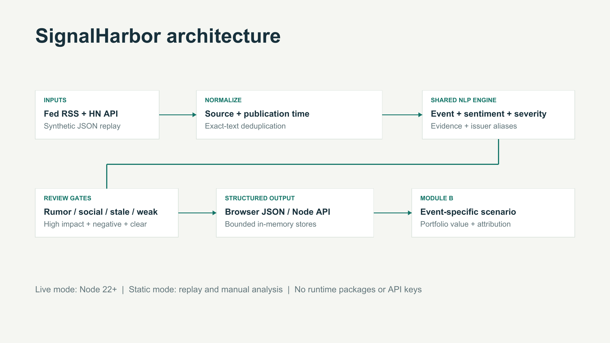

# SignalHarbor - S&P Global & Crisil Campus Hackathon

**Candidate Name:** Dhruv Thacker  
**College Email ID:** dhruv8.mitmpl2023@learner.manipal.edu  
**College / Campus:** Manipal Institute of Technology, Manipal  
**Selected downstream module:** Module B - Strategic Portfolio Stress Testing  
**Interactive Demo:** [Open SignalHarbor](https://avid-developer.github.io/mit-manipal-dhruv-thacker-hackathon/)  
**Presentation:** [Seven-slide PDF](docs/presentation.pdf)  
**Demo Video Link:** [Watch the unlisted 4:22 walkthrough](https://youtu.be/1MJm6us3o0I).

## 1. Project Overview / Problem Statement & Approach

Financial news and community posts mix important events with duplicates, uncertain claims, and routine updates. SignalHarbor converts short text into an inspectable risk signal: sentiment in [-1, 1], one of seven event classes, a severity proxy in [1, 10], source provenance, matched fictional issuers, and review flags.

The shared JavaScript engine runs in a browser or behind a Node API. A trained multinomial Naive Bayes event classifier combines with a financial sentiment lexicon and transparent severity rules. A downstream stress lab applies event-specific assumptions to a synthetic USD 100 million wholesale-banking portfolio. It displays baseline value, stressed value, and position-level P&L. Users can change severity, inspect contributing terms, and export structured signals and scenarios.

This is an educational research prototype. Scenarios are hypothetical calculations, not forecasts or trading recommendations. No trading or account actions are implemented.

## 2. Architecture & Tech Stack



- **UI:** HTML, CSS, and browser JavaScript modules. Optional Google Fonts have system-font fallbacks.
- **Runtime:** Node.js 22 or newer; native HTTP server and `fetch`. **No runtime npm package dependencies or API keys.**
- **Event model:** Original implementation of multinomial Naive Bayes, unigram/bigram features, Laplace smoothing alpha 0.5. Trains from the supplied JSON at startup.
- **Sentiment:** Financial valence lexicon, three-token negation window with punctuation boundaries, normalized to [-1, 1].
- **Severity:** Event base + up to 2 points for sentiment magnitude + 2 for a severe, non-negated term, clipped to [1, 10]. Qualified wording caps severity at 7.
- **Trigger:** Severity > 7, sentiment < -0.15, and no review flag. Social, stale (>72 hours), future-dated, uncertain, and weak-evidence reports require review.
- **State:** Separate in-memory browser and API stores, each limited to 500 signals. Normalized exact-text deduplication; no durable database. Browser analysis does not write into the server store.
- **Outputs:** JSON through the API or browser downloads, plus an interactive dashboard.

### Stress calculation

For each exposed position:

```text
P&L = - rate_DV01 * rate_shock_bps
      - spread_DV01 * spread_shock_bps
      + equity_exposure * equity_return
      - loan_credit_exposure * credit_haircut
```

All shocks scale by `impact_score / 10`. Bond spread exposure and loan credit haircut exposure are disjoint in the fixture, avoiding an additional default haircut on the same bond. A pay-fixed rate swap has negative rate DV01, so it gains when rates increase. Its mark-to-market value differs from its risk exposure.

Geopolitical and macroeconomic scenarios affect the entire portfolio. Credit, cyber, M&A, and product events affect only matching fictional issuers. An unmatched issuer gives a warning and zero issuer-specific P&L. Every scenario starts from the original portfolio; repeated events do not compound losses. Manual scenario exploration is clearly distinguished from an automatic trigger.

## 3. Dataset Used

All default demo inputs are included under `data/`; no proprietary or client data is used.

| File | Contents / assumptions |
|---|---|
| `training.json` | 84 original, AI-assisted synthetic sentences; 12 per event class. |
| `evaluation.json` | 28 separately authored synthetic diagnostic sentences, four per class; no exact training-text overlap. Same author/domain means this is not an independent benchmark. |
| `news.json`, `social.json` | 14 fictional news/social records. One duplicate, rumors, a denial, and a benign update test handling. Replay substitutes the current simulation time; source files preserve authored timestamps. |
| `portfolio.json` | 11 fictional positions: loans, bonds, derivatives, and equity; USD 100m net marked value. DV01 means USD per one basis point. |
| `evaluation_results.json` | Every prediction, confusion matrix, measured local timing, and environment. |
| `sources.json` | Provenance, assumptions, and exact live-source endpoints. |
| `live_snapshot.json` | Timestamped public-source ingestion audit with 12 Federal Reserve and 12 Hacker News records; separate from replay fixtures. |

**Live adapters:** [Federal Reserve RSS](https://www.federalreserve.gov/feeds/feeds.htm) provides official news titles and summaries. [Hacker News Search API](https://hn.algolia.com/api) provides community-submitted story titles matching `bank`; this is a social-discussion proxy, not a representative investor-sentiment sample. Both returned 12 records in the saved audit. A previous Federal Reserve request returned HTTP 404; the app surfaced that failure, and a subsequent request succeeded. The saved snapshot is an audit, not a guaranteed future response. Source freshness depends on each publisher. The app retains publication time and marks stale reports for review.

Live content is transient and may change. Export a JSON snapshot from the dashboard to retain the exact records used in a session. Live records are never substituted with synthetic data after a network failure. Endpoints are fixed; no arbitrary-URL fetch proxy is exposed. Polls use a 60-second cooldown, a 15-second timeout, and a 1.5 MB response limit.

## 4. Quickstart & Installation

Runtime: **Node.js 22+**. Tested on macOS arm64 with Node 23.11.0. Any modern browser supports the demo. There is no package installation step.

Clone this public repository:

```bash
git clone https://github.com/avid-developer/mit-manipal-dhruv-thacker-hackathon.git
cd mit-manipal-dhruv-thacker-hackathon
npm start
```

Open **http://127.0.0.1:8787**. The app starts in clearly labeled synthetic replay mode.

1. Review the 13 unique signals and selected geopolitical event.
2. Open **Stress lab** to inspect the USD 100m baseline and USD 92.32m stressed value.
3. Adjust severity to 5; the independent scenario loss halves to USD 3.84m.
4. Select an issuer credit event to see only matching positions change.
5. Return to the monitor and analyze your own text.
6. Select **Poll live sources** for actual public inputs. Optional 60-second polling stops when unchecked or when replay starts.
7. Export signals or a scenario as JSON.

The static UI can also run on GitHub Pages. Static hosting supports replay, manual analysis, and stress testing; **live ingestion and the HTTP API require `npm start` locally**. No remote service is needed for the static demo.

```bash
npm test          # 22 functional and HTTP integration tests
npm run evaluate # regenerate the synthetic evaluation report
node src/capture-live.mjs # save a fresh public-source ingestion audit
```

Tests temporarily bind loopback port 18887. The app defaults to loopback port 8787. Set `PORT` to change the app port. Leave the default loopback binding for personal use; this development server is not an authenticated production service.

### API examples

```bash
curl http://127.0.0.1:8787/api/health

curl -X POST http://127.0.0.1:8787/api/analyze \
  -H 'Content-Type: application/json' \
  -d '{"text":"Aster Bank defaults on debt and files for bankruptcy.","source_type":"news","synthetic":true}'

curl http://127.0.0.1:8787/api/signals

curl -X POST http://127.0.0.1:8787/api/poll \
  -H 'Content-Type: application/json' -d '{}'
```

Use a returned `signal.id` in `POST /api/stress` with `{"signal_id":"..."}`. Optional `overrides` accepts `rate_bps`, `spread_bps`, `equity_pct`, and `credit_haircut` within documented code bounds. API stores reset when the server restarts.

## 5. Key Results & Domain Impact

| Check | Observed result | Interpretation |
|---|---|---|
| Functional / HTTP tests | 22 / 22 passed | Bounds, input errors, negation, rumor handling, duplicate control, source parsing, issuer scope, hedge sign, reconciliation, and HTTP behavior. |
| Event diagnostic accuracy | 28 / 28 (100%); macro F1 1.000 | Only the supplied small synthetic set; not real-news accuracy. Majority-class baseline is 14.3%. |
| Local engine latency | Median 0.049 ms; p95 0.407 ms across 1,000 calls | Measured on Node 23.11.0 / macOS arm64; excludes network, training, and UI. Reruns may vary. |
| Replay | 14 inputs; 13 unique; 3 triggers; 6 review flags | Original deterministic sample; counters change with manual/live inputs. |
| Geopolitical scenario | USD 100.00m to USD 92.32m; USD 7.68m loss | Assumed +75 bps rates, +150 bps spreads, -12% equity, 4% loan haircut at severity 10. |
| Aster credit scenario | USD 100.00m to USD 96.2025m | Only Aster exposures move; this is a scenario assumption, not a default-loss estimate. |

The operational value is a reproducible route from a report to a reviewable scenario: provenance and evidence remain attached, review gates separate unsupported claims, and portfolio attribution shows where a hypothetical exposure lies. The project does not claim measured analyst time savings, predictive investment returns, or production readiness.

## 6. Limitations & Next Steps

- The small synthetic training set has limited linguistic variety. Sarcasm, entity ambiguity, mixed events, indirect negation, and domain shift remain unresolved.
- Naive Bayes scores are uncalibrated. Sentiment and severity are heuristics; there is no labeled real-world validation for either.
- Exact-text deduplication does not cluster paraphrases or reconcile conflicting sources. It does not prove source independence.
- Counterparty matching uses aliases for five fictional issuers. Most live company reports will not map to this synthetic portfolio.
- DV01 is a first-order approximation; large scenarios need full instrument repricing. Default probability, recovery, nonlinear option risk, liquidity, and correlated contagion are omitted.
- Future work: independently labeled finance corpus with time-based splits, calibrated uncertainty, robust entity linking, semantic event clustering, and validated pricing models.

## 7. AI Usage & License

AI assistance supported original code, synthetic examples, tests, writing, presentation preparation, and demo production. The demo is an edited walkthrough of actual application captures with synthesized narration, not a recording of the participant's voice. Its [narration script](docs/demo-script.md) and [caption file](docs/demo-captions.srt) are included. No pre-existing project was copied. The implementation is intended to be inspected and explained by the participant at the live jury pitch. See [MIT License](LICENSE).

Method reference: [scikit-learn's Naive Bayes explanation and probability caveat](https://scikit-learn.org/stable/modules/naive_bayes.html). The implementation here is original JavaScript and does not depend on scikit-learn.
